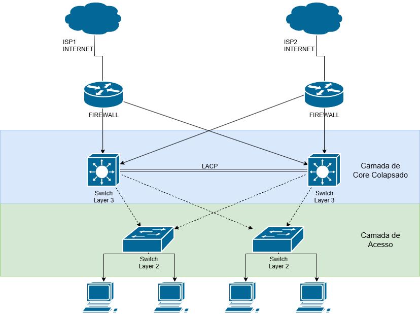
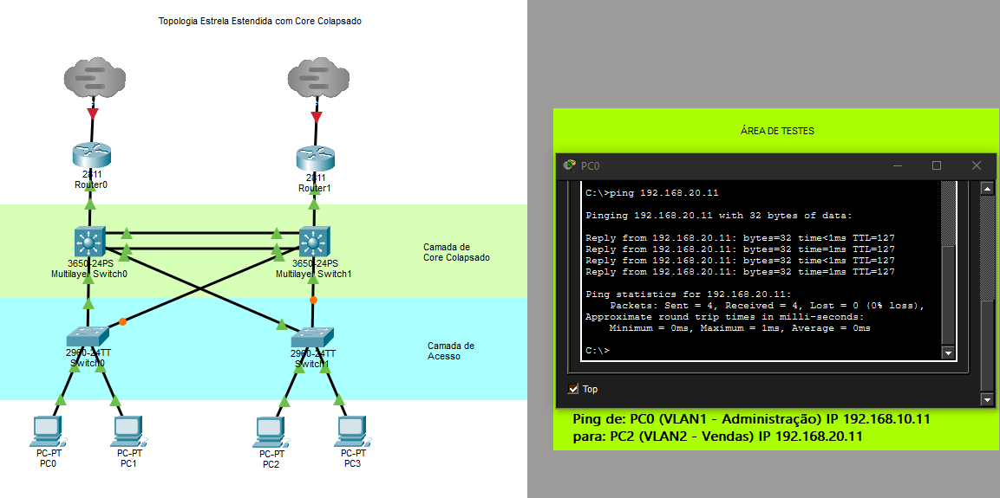
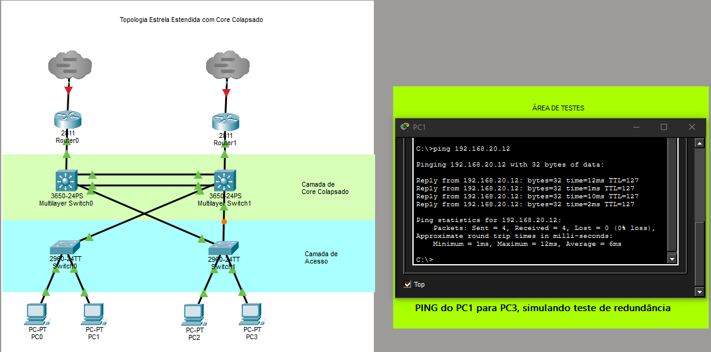
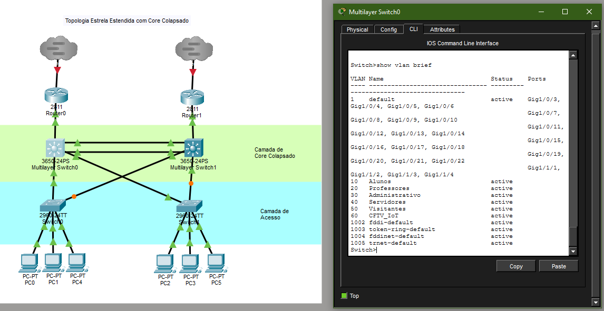
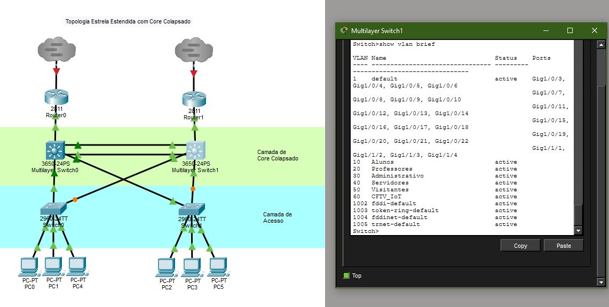

# Projeto Técnico de Topologia Two-Tier com Core Colapsado

## Informações do Projeto

Repositório do Projeto: [https://github.com/devrenj/grau_tecnico-redes_de_computadores](https://github.com/devrenj/grau_tecnico-redes_de_computadores)
Conteúdo: Documentação, Projeto desenvolvido no Packet Tracer, Diagramação desenvolvida no Draw.io

Publicação/Demonstração: [https://www.linkedin.com/posts/devrenj_redesdecomputadores-cisco-packettracer-ugcPost-7485171689597734912-CR1n](https://www.linkedin.com/posts/devrenj_redesdecomputadores-cisco-packettracer-ugcPost-7485171689597734912-CR1n)
Conteúdo: Resumo da elaboração do trabalho

Registro Acadêmico Oficial: [https://lattes.cnpq.br/6073310779255104](https://lattes.cnpq.br/6073310779255104)

---

Escola: Grau Técnico
Professor: Geovane Estanislau
Turma: INF14T-M-3D
Autores: André Ângelo Ramos, João Paulo de Carvalho Silva, Roberto Edaes Nóbrega Júnior, Vitória Gomes de Souza

---

## Diagrama Técnico - Escopo do Projeto

Topologia Estrela Estendida com Core Colapsado (Two-Tier)



---

## Análise Técnica

Links de Internet (ISP1 e ISP2): Provedores de internet redundantes operando em modo de alta disponibilidade para garantir que a empresa não fique offline caso um link caia.

Firewalls de Borda: Responsáveis pelo roteamento de saída, segurança de perímetro (filtros de pacotes) e distribuição de carga entre os links de internet.

Camada de Core Colapsado (Switches Layer 3): Centraliza as funções de núcleo e distribuição em apenas dois equipamentos de alta performance. Eles gerenciam o roteamento interno da rede e utilizam o protocolo LACP (EtherChannel) para criar um link de alta velocidade e tolerância a falhas entre si.

Camada de Acesso (Switches Layer 2): Equipamentos de baixo custo dedicados exclusivamente a conectar os dispositivos finais (PCs) à rede, encaminhando o tráfego diretamente para o Core.

---

## Relatório Técnico de Implementação de Infraestrutura de Rede

Projeto: Arquitetura de Duas Camadas com Core Colapsado (Two-Tier) e Redundância
Ambiente de Simulação: Cisco Packet Tracer v9.0
Arquivo gerado: [ProjetoIntegradorFinal.pkt](src/ProjetoIntegradorFinal.pkt)

---

## Escopo e Justificativa do Projeto

O objetivo deste projeto foi projetar e simular uma rede local (LAN) corporativa de baixo custo, alta disponibilidade e tolerância a falhas.

Optou-se pela arquitetura Two-Tier (Core Colapsado), fundindo as camadas de Núcleo (Core) e Distribuição em um único par de switches multicamada (Layer 3). Essa escolha reduz drasticamente os custos com hardware, mantendo a capacidade de gerenciar o roteamento interno de forma centralizada e ultrarrápida.

A rede foi logicamente dividida em duas redes virtuais para isolamento de tráfego e segurança:

VLAN 10 (Administração): Sub-rede 192.168.10.0/24 (Hosts da esquerda)
VLAN 20 (Vendas): Sub-rede 192.168.20.0/24 (Hosts da direita)

---

## Projeto de Implementação

O projeto técnico realizado utilizando o programa CISCO Packet Tracer teve sua estruturação implementada conforme as etapas abaixo.

---

### Etapa 1: Montagem do Cenário e Energização do Core

A estrutura física foi desenhada em uma topologia estrela estendida. Foram utilizados dois switches de Acesso (Cisco Catalyst 2960), dois switches de Core (Cisco Catalyst 3650), dois roteadores de borda (Cisco 2811) e duas nuvens simulando provedores de internet (ISP1 e ISP2).

Ajuste de Hardware: Como o modelo 3650 vem desprovido de energia de fábrica no simulador, o primeiro passo prático foi a inserção física dos módulos de alimentação AC-POWER-SUPPLY em ambos os equipamentos do Core.

Cabeamento: As conexões entre os hosts e switches, e entre os switches de acesso e o Core, foram feitas cruzadas em formato de "X" utilizando cabos de cobre direto (Copper Straight-Through), garantindo caminhos físicos alternativos para os dados.

---

### Etapa 2: Segregação de Tráfego na Camada de Acesso (Switches Layer 2)

Nos switches de borda (Switch0 e Switch1), criamos a base de dados de VLANs para que ambos conhecessem as redes da empresa e associamos os computadores às suas respectivas redes virtuais.

Comandos aplicados no Switch0 e Switch1:

```text
enable
configure terminal
vlan 10
 name Administracao
vlan 20
 name Vendas
exit
```

Configuração das portas dos usuários (Modo Access):
No Switch0 (Esquerda), colocamos os PCs na VLAN 10. No Switch1 (Direita), colocamos os PCs na VLAN 20:

```text
interface range fastEthernet 0/1 - 2
 switchport mode access
 switchport access vlan 10
```

Resultado do Passo 2: Validado através do comando show vlan brief, que confirmou com sucesso o status active das novas redes e a migração das portas físicas dos computadores para fora da VLAN 1 padrão.

---

### Etapa 3: Criação das Estradas de Dados (Modo Trunk e EtherChannel)

Para que os switches de baixo pudessem enviar dados de múltiplas VLANs para os switches de cima, configuramos os links de subida como Trunk. Além disso, unimos os dois switches de Core com um cabo duplo em alta velocidade usando o protocolo LACP (EtherChannel).

Comandos de Trunk nos Switches de Acesso (Switch0 e Switch1):

```text
interface range fastEthernet 0/23 - 24
 switchport mode trunk
```

Configuração do Core (Switches 3650):
Por se tratar de portas multicamada, aplicamos o comando switchport para forçá-las a operar na Camada 2 antes de aplicar o tronco e o agrupamento:

```text
interface range gigabitEthernet 1/0/1 - 2
 switchport
 switchport mode trunk
exit
interface range gigabitEthernet 1/0/23 - 24
 switchport
 switchport mode trunk
 channel-group 1 mode active
exit
```

Resultado do Passo 3: O comando show interfaces trunk validou que a interface lógica agregada Po1 (Port-Channel) e as portas físicas de descida foram ativadas com sucesso no padrão de encapsulamento nativo 802.1q.

---

### Etapa 4: Ativação do Roteamento Inter-VLAN (Layer 3)

Com as estradas construídas, os computadores da Administração ainda não conseguiam falar com Vendas. Ativamos a capacidade de roteamento dos switches 3650 e criamos as interfaces virtuais (SVIs) para funcionarem como os Gateways da rede.

Configuração no Core da Esquerda (Multilayer Switch0):

```text
ip routing
interface vlan 10
 ip address 192.168.10.1 255.255.255.0
interface vlan 20
 ip address 192.168.20.1 255.255.255.0
```

Configuração no Core da Direita (Multilayer Switch1):
Aplicamos a mesma lógica, determinando os IPs de final .2 para redundância (192.168.10.2 e 192.168.20.2).

---

### Etapa 5: Ativação dos Roteadores de Borda (Saída WAN)

Os roteadores de borda vieram com as interfaces desligadas por padrão de segurança da Cisco. Entramos na linha de comando e ativamos os links que sobem para a nuvem de internet e os que descem para o Core.

Comandos no Router0 e Router1:

```text
interface fastEthernet 0/0
 no shutdown
interface fastEthernet 0/1
 no shutdown
```

Fizemos o ajuste no Core liberando as portas correspondentes (interface gigabitEthernet 1/0/2 -> no shutdown), o que fez toda a topologia física acender em verde.

---

## Resultados Finais e Comportamentos Observados

Validação do Roteamento (O Teste do Ping):
Ao acessar o Prompt de Comando do PC0 (VLAN 10) e disparar um teste para o PC2 (VLAN 20) através do comando `ping 192.168.20.11`, obtivemos 0% de perda de pacotes (Packets: Sent = 4, Received = 4, Lost = 0). Isso chancela que os switches de Core estão roteando os pacotes perfeitamente entre as redes virtuais.



Comportamento do Spanning Tree (A Porta Laranja):
Observou-se que a porta Fa0/24 do switch de acesso permaneceu na cor laranja. Esse comportamento é tecnicamente perfeito. O protocolo STP detectou o loop físico gerado pelo cabeamento em "X" e bloqueou logicamente aquela porta para evitar uma tempestade de broadcast, mantendo-a como um link de reserva imediato caso o cabo principal falhe.



Status da Nuvem:
Os triângulos superiores das nuvens permaneceram vermelhos, o que está correto dentro das limitações de escopo do simulador, já que representam o lado externo e passivo do link do provedor (WAN), não interferindo no sucesso do tráfego interno controlado pelos nossos roteadores.

---

## Etapa 6: Escalando VLANs

Quando a base do projeto ficou sólida, foram adicionadas todas as VLANs corretamente, sendo elas:

| VLAN | NOME | FINALIDADE |
| :--- | :--- | :--- |
| 10 | Alunos | Acesso aos sistemas acadêmicos e à internet. |
| 20 | Professores | Acesso aos recursos utilizados por docentes pesquisadores. |
| 30 | Administrativo | Comunicação dos setores administrativos da instituição. |
| 40 | Servidores | Hóspedes dos serviços essenciais da rede. |
| 50 | Visitantes | Acesso exclusivo à internet, sem comunicação com a rede interna. |
| 60 | CFTV e IoT | Equipamento de monitoramento e dispositivos inteligentes. |

Visualizando VLANs em Switch0:


Visualizando VLANs em Switch1:


---

## Conclusão

O projeto encerrado com êxito e todas as configurações ativas foram salvas na memória não-volátil dos dispositivos através do comando write memory. A infraestrutura está pronta para produção.

---

## Fontes e Ferramentas

Cisco Packet Tracer: [https://netacad.com/pt/cisco-packet-tracer](https://netacad.com/pt/cisco-packet-tracer)
Draw.io: [https://drawio.com](https://drawio.com)